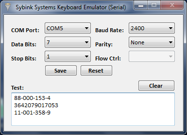
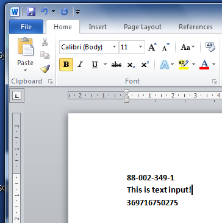
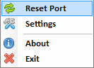

# Sybink Systems Keyboard Emulator (Serial)

A keyboard emulator for serial devices.

Easy to install and configure, this lightweight application emulates a serial device as a HID keyboard to the operating system. It runs automatically at startup, capturing input from your serial device and delivering it to the OS as if it were typed on a keyboard. We designed the tool for our clients using legacy serial peripherals — like barcode scanners. This tool seamlessly sent the device output to any running application in focus.

> Serial communication settings for your device and text pane for testing

> Input from keyboard emulator is passed to any application that has text focus

> Context menu

## Running Keyboard Emulator

Either build from source or run the installer in the release, and configure the settings for your device.

